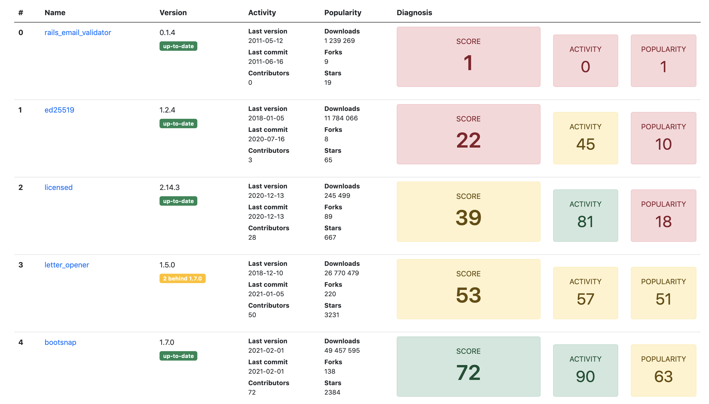

# GemsBond

GemsBond inspects your Gemfile and calculates a score for each gem depending on its activity and popularity.

## Installation

Add this line to your application's Gemfile:

```ruby
gem 'gems_bond'
```

And then execute:

    $ bundle install

Or install it yourself as:

    $ gem install gems_bond

## Usage

First, you need to get a GithHub token since the gem fetches data from the GitHub API.

When logged in on GitHub, go in https://github.com/settings/tokens and generate a new token.

A readonly token is enough, you can leave all checkbox unchecked.

Add the token in your config:

```ruby
# config/initializers/gems_bond.rb

GemsBond.configure do |config|
  config.github_token = 'my_github_readonly_token'
end
```

Then run the task:

```bash
bundle exec rake gems_bond:spy
```

You can provide the token at this moment if it is not set in configuration or if you want to override it:

```bash
bundle exec rake gems_bond:spy GITHUB_TOKEN=my_github_readonly_token
```

The output can then be read in `gems_bond/spy.html`.



## Development

After checking out the repo, run `bin/setup` to install dependencies. Then, run `rspec` to run the tests, and `rspec --tag ~@api` to skip tests calling RubyGems and GitHub APIs. Run You can also run `bin/console` for an interactive prompt that will allow you to experiment.

To install this gem onto your local machine, run `bundle exec rake install`. To release a new version, update the version number in `version.rb`, and then run `bundle exec rake release`, which will create a git tag for the version, push git commits and the created tag, and push the `.gem` file to [rubygems.org](https://rubygems.org).

## Contributing

Bug reports and pull requests are welcome on GitHub at https://github.com/[USERNAME]/gems_bond.

## License

The gem is available as open source under the terms of the [MIT License](https://opensource.org/licenses/MIT).
